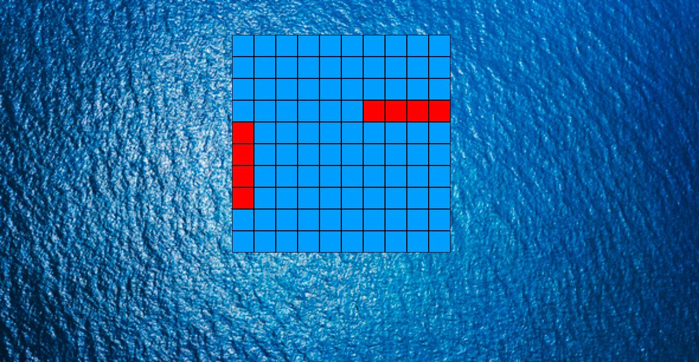

# Battleship-JavaScript
A very very simple Battleship game written in plain JavaScript: http://learntocodela.github.io/Battleship-JavaScript/

I changed the rules slightly. A "Ready" message promps at the beginning and when you click it it shows you where the ships are for a second. You then have to hit all the ships with only a set amount of misses.

